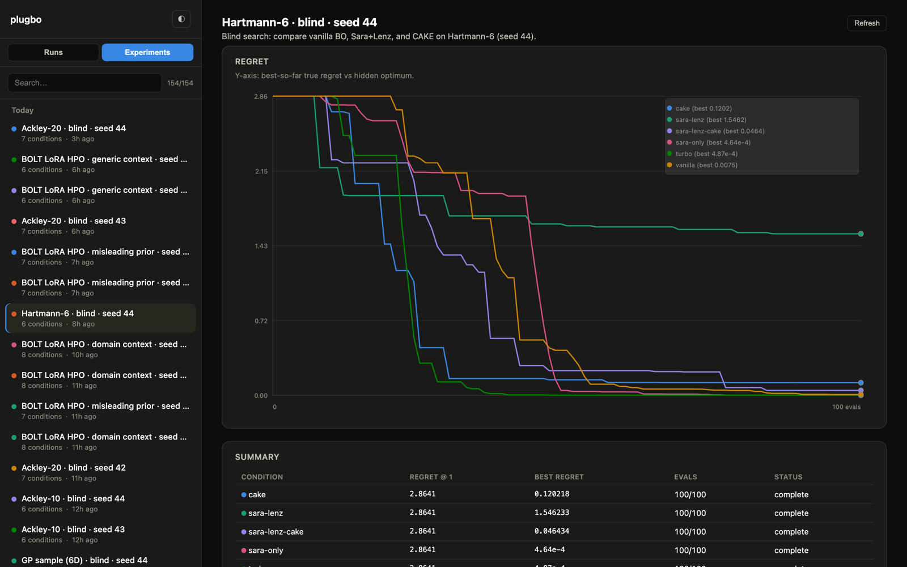

<p align="center">
  
</p>

A modular framework for **agentic Bayesian optimization**.

[](LICENSE)
[](https://www.python.org/downloads/)
[](https://github.com/richardcsuwandi/plugbo/actions/workflows/tests.yml)

[Blog](https://richardcsuwandi.github.io/blog/2026/plug-bo/) · [Install](#install) · [Plugins](#plugins) · [Experiments](#experiments) · [Contributing](#contributing)


Bayesian optimization (BO) uses a probabilistic surrogate to choose each
evaluation, but its overall search strategy is usually fixed in advance.
Agentic BO places an LLM agent at the center of the loop: it reviews trial data,
surrogate diagnostics, and natural-language context, then decides how to search
next. As evidence accumulates, the agent can query or override backend
suggestions and revise the surrogate, acquisition function, search bounds,
objectives, or constraints [[1]](#ref-1).

Meta's *Agentic Bayesian Optimization through Surrogate-Augmented Autoresearch*
instantiates that idea as Sara, a campaign LLM, calling lenz, a BoTorch CLI that
owns the trial log, posterior, and acquisition [[1]](#ref-1) [[6]](#ref-6).
PlugBO keeps that agent and CLI, then turns the backend into a plugin surface:
surrogate, region, prior, and sampler are slots. Existing and new BO modules
wrap as `lenz` verbs the agent can enable, inspect, or override. The arrangement is
analogous to [MCP](https://modelcontextprotocol.io/): Sara is the host, with
only `bash` and `read`, and lenz is the shared tool surface. A BO method
registers extra verbs there the way an MCP server registers tools, so the agent
stays fixed while the surrogate, region, prior, or sampler can be swapped in as
a plugin.

> Note: PlugBO is not an official implementation of Meta's agentic BO paper
> [[1]](#ref-1). What is new here is the plugin protocol, together with new
> experiments and results.

The [technical blog post](https://richardcsuwandi.github.io/blog/2026/plug-bo/)
covers the implementation, experimental setup, and results in more detail.

#### Why PlugBO?

* Puts an LLM in charge of a live BO campaign. The agent can inspect trials
  and change the surrogate, bounds, or acquisition mid-run, while BoTorch
  still keeps the posterior.
* Lets you use existing and new BO modules (CAKE, TuRBO, πBO, LLAMBO) in that
  same campaign. Enable one with a `lenz` command; you do not maintain a
  separate optimizer per method.
* Makes it straightforward to add a new method as a plugin, without changing
  the agent or discarding completed trials.
* Includes a comparison harness for synthetic functions and mixed-type tasks
  such as LoRA hyperparameter optimization, with runs that hide the function
  name so an LLM comparison is not a retrieval test.
* Plots repeated seeds as a mean ± SE band in a local viewer, so a condition
  is not judged from one noisy curve.

---

## Install

Not on PyPI. Two ways to install from source (Python 3.10+):

**Editable install**

```bash
git clone https://github.com/richardcsuwandi/plugbo.git
cd plugbo
pip install -e .
```

That pulls `torch`, `gpytorch`, `botorch`, and LLM clients (`anthropic`,
`openai`). Copy `.env.example` to `.env` if you will call an LLM.

**Dev install** (tests, plus the LoRA HPO emulator extra)

```bash
pip install -e ".[dev]"    # tests
pip install -e ".[bolt]"   # LoRA HPO emulator (BoLT)
```

---

## Plugins

Sara, lenz, and the BO methods are the same kind of piece: modules on one
control plane. Sara is the host (`bash` and `read`). lenz is the tool surface.
Existing and new BO modules (CAKE, TuRBO, πBO, LLAMBO) occupy slots on that
surface.

| Module | Role | Default | Occupant | Commands |
|---|---|---|---|---|
| `sara` | campaign agent | — | — | `sara run` |
| `lenz` | trial log, posterior, acquisition | BoTorch loop | — | `create`, `suggest`, `submit`, `incumbent` |
| Surrogate | GP | fixed Matérn | **CAKE** [[2]](#ref-2) | `set-surrogate`, `evolve-kernels`, `kernel-population` |
| Region | search bounds | box | **TuRBO** [[3]](#ref-3) | `set-region`, `set-bounds`, `turbo status` |
| Prior | belief | none | **πBO** [[4]](#ref-4) | `set-belief` |
| Sampler | candidates | BoTorch | **LLAMBO** [[5]](#ref-5) | `set-sampler`, `llambo sample` |

Occupying a slot is a `set-*` verb. Plugins may add more verbs. Method state
lives in `state.json` under `plugins`, not on the live shelf. Reconfiguring
never discards trials. `lenz plugins` lists installed modules.

Vanilla loop (no LLM):

```bash
lenz create --state ./state.json \
  --space '{"x1":{"kind":"range","lower":-5,"upper":10},"x2":{"kind":"range","lower":0,"upper":15}}' \
  --objectives '{"y":"minimize"}' \
  --acqf noisy_logei

lenz suggest --state ./state.json
lenz submit --state ./state.json --config '{"x1":1.0,"x2":2.0}' --metrics '{"y":12.3}'
lenz incumbent --state ./state.json
```

Agent in the loop:

```bash
sara run \
  --provider anthropic --model claude-opus-5 \
  --context examples/branin/context.md \
  --eval "python3 examples/branin/eval.py" \
  --budget 30 \
  --workdir ./results/logs/branin-1
```

`--context` is problem markdown, `--eval` is a command that takes one config
JSON. `--no-lenz` drops the backend: Sara proposes configs and calls
`./oracle` herself.

| `--provider` | Notes |
|---|---|
| `anthropic` | `ANTHROPIC_API_KEY` |
| `openai` | `OPENAI_API_KEY` |
| `openai-compatible` | Requires `--base-url` |
| `ollama` | `http://localhost:11434/v1` by default |

Occupy a slot, with or without the agent:

```bash
lenz set-surrogate --state ./state.json --surrogate cake
lenz set-region --state ./state.json --policy turbo
lenz set-belief --state ./state.json --prior '{"x":{"dist":"normal","mu":0.3,"sigma":0.1}}'
lenz set-sampler --state ./state.json --sampler llambo
```

```bash
lenz create --state ./state.json \
  --space '{"x1":{"kind":"range","lower":-5,"upper":10},"x2":{"kind":"range","lower":0,"upper":15}}' \
  --objectives '{"y":"minimize"}' \
  --surrogate cake --budget 30
```

CAKE and LLAMBO inherit Sara's provider and model. Pass `--kernel-llm-*` or
`--sampler-llm-*` only to use a different model. TuRBO and πBO do not call an
LLM. CAKE evolves a GP kernel population inside `lenz` during
`observe`/`submit` [[2]](#ref-2); that trace is not part of Sara's conversation.

Command reference: `sara/prompts/LENZ_REF.md`. To add a method, implement
`LenzPlugin` in `lenz/plugins/`, ship a `{name}.md` prompt beside it, and
register it in `registry.py`. See [CONTRIBUTING.md](CONTRIBUTING.md).

---

## Experiments

Textbook functions such as Hartmann and Ackley have published optima that an
LLM can recall. The synthetic harness therefore uses an anti-memorization
sandbox: renamed parameters, a unit cube, and a shifted optimum. Scoring
uses a hidden answer key outside the sandbox. List functions:

```bash
python3 -c "from benchmarks.functions import REGISTRY; print(sorted(REGISTRY))"
```

```bash
./scripts/run_synthetic.sh hartmann6
./scripts/run_synthetic.sh hartmann6 --disclosure revealed
./scripts/run_synthetic.sh hartmann6 --disclosure revealed-shift
./scripts/run_synthetic.sh hartmann6 --backend sara-lenz --disclosure all
./scripts/run_synthetic.sh hartmann6 --warmup 7
```

`--disclosure` controls how much identity the agent sees:

* `blind` (default): renamed parameters, unit cube, shifted optimum, generic
  problem text. This is the search comparison, not a retrieval test.
* `revealed-shift`: real name and bounds, same shift as the blind run.
  Search is still required.
* `revealed`: the textbook problem, unshifted. The headline metric is
  whether evaluation 1 is already the known optimum.
* `all`: run the three levels. Needs a single `--backend`.

`--backend` is a comma list (`vanilla`, `cake`, `turbo`, `sara-lenz`,
`sara-lenz-cake`, `sara-only`), or `all` for vanilla + sara-lenz +
`sara-lenz-cake`. Every backend uses the same seeded Sobol warm-start,
defaulting to `d+1` evaluations when a seed is set. Pass `--warmup N` to
override it for all selected backends.

`gp_sample<dim>` is a no-prior control (a fresh GP sample path, not in
`REGISTRY`). Run it the same way as `hartmann6`.

### LoRA hyperparameter optimization

The mixed-type experiment is LoRA hyperparameter optimization on
BoLT (Black-box Optimization for LLM Tasks) [[7]](#ref-7). There is no
textbook optimum to recall. The oracle is a deterministic emulator of
expensive LLM fine-tuning runs. The search space is always revealed (seven
mixed continuous, integer, and categorical variables). `--context` only
changes the story the agent reads, not the space:

* `domain` (default): real LoRA/Qwen names and a short task description.
* `generic`: names, types, and bounds only. No domain prose.
* `misleading`: false LoRA folklore (dropout near 0.05, `lora_target = 0`,
  few layers) presented as known-good defaults.

```bash
pip install -e '.[bolt]'
./scripts/run_bolt.sh
./scripts/run_bolt.sh --backend vanilla,cake
./scripts/run_bolt.sh --context generic
```

Provider and model come from `.env` or `PROVIDER` / `MODEL`. Completed and
in-flight legs are skipped. Plots land in `compare.html` next to the run, or
open `plugbo-viz`.

---

## Run viewer

`plugbo-viz` is a local UI over campaign logs. Open a run to read the trial
table, the agent trace, tool-use over the campaign, and (when CAKE is on)
the kernel population. Search the sidebar, tick several runs to overlay
them, or switch to Experiments to put every condition in a group on one
regret chart.

```bash
plugbo-viz
plugbo-viz --root ./results/logs --port 9000
```



You can also run `python3 -m viz.merged_server` to see a single merged regret
chart for all conditions, or open `plugbo-viz` to compare multiple runs.
---

## Development

```bash
pip install -e ".[dev]"
pytest -m "not slow"
./scripts/smoke_plugins.sh
```

Optional smoke flags and what they cover are in
[CONTRIBUTING.md](CONTRIBUTING.md). The script header is the source of truth
for `--live`, `--baseline`, and any later flags.

---

## Contributing

Bug reports, new BO plugins, and benchmarks are welcome.

- [CONTRIBUTING.md](CONTRIBUTING.md): setup, plugin protocol, adding a function
- [Issues](https://github.com/richardcsuwandi/plugbo/issues): bugs and proposals
- [Code of Conduct](CODE_OF_CONDUCT.md)

Please open an issue before a new slot, a large dependency, or a new
experiment backend.

---

## Citation

If you use PlugBO, please cite this repository (GitHub's cite button uses
[`CITATION.cff`](CITATION.cff)) and the papers for any plugins
you enable. The Sara/lenz design is from Brunzema et al. [[1]](#ref-1).

---

## License

MIT. See [LICENSE](LICENSE). Contributions are under the same license.

---

## References

1. <span id="ref-1"></span> Brunzema, P., Tiao, L., Le, N., De Angeli, K., Xuan, Y.,
   Gligorijevic, D.
   *Agentic Bayesian Optimization through Surrogate-Augmented Autoresearch.*
   arXiv:2608.00316, 2026.
   [Paper](https://arxiv.org/abs/2608.00316)
   No official code (this repo is an independent re-implementation).

2. <span id="ref-2"></span> Suwandi, R. C., Yin, F., Wang, J., Li, R., Chang, T.-H.,
   Theodoridis, S.
   *Adaptive Kernel Design for Bayesian Optimization Is a Piece of CAKE with
   LLMs.* NeurIPS 2025.
   [Paper](https://proceedings.neurips.cc/paper_files/paper/2025/file/c03a2610bca2712b984b331fd4f7bb6f-Paper-Conference.pdf)
   [Code](https://github.com/richardcsuwandi/cake)

3. <span id="ref-3"></span> Eriksson, D., Pearce, M., Gardner, J., Turner, R. D.,
   Poloczek, M.
   *Scalable Global Optimization via Local Bayesian Optimization.* NeurIPS 2019.
   [Paper](https://arxiv.org/abs/1910.01739)
   [Code](https://github.com/uber-research/TuRBO)

4. <span id="ref-4"></span> Hvarfner, C., Stoll, D., Souza, A., Lindauer, M.,
   Hutter, F., Nardi, L.
   *πBO: Augmenting Acquisition Functions with User Beliefs for Bayesian
   Optimization.* ICLR 2022.
   [Paper](https://arxiv.org/abs/2204.11051)
   [Code](https://github.com/piboauthors/PiBO-Spearmint)

5. <span id="ref-5"></span> Liu, T., Astorga, N., Seedat, N., van der Schaar, M.
   *Large Language Models to Enhance Bayesian Optimization.* ICLR 2024.
   [Paper](https://arxiv.org/abs/2402.03921)
   [Code](https://github.com/tennisonliu/LLAMBO)

6. <span id="ref-6"></span> Balandat, M., Karrer, B., Jiang, D. R., Daulton, S.,
   Letham, B., Wilson, A. G., Bakshy, E.
   *BoTorch: A Framework for Efficient Monte-Carlo Bayesian Optimization.*
   NeurIPS 2020.
   [Paper](https://arxiv.org/abs/1910.06403)
   [Code](https://github.com/meta-pytorch/botorch)

7. <span id="ref-7"></span> Chew, R. W. T., Chen, Z., Hemachandra, A., Low, B. K. H.
   *BoLT: A Benchmark to Democratize Black-box Optimization Research for
   Expensive LLM Tasks.* arXiv:2605.17000, 2026.
   [Paper](https://arxiv.org/abs/2605.17000)
   [Code](https://github.com/chewwt/bolt)
