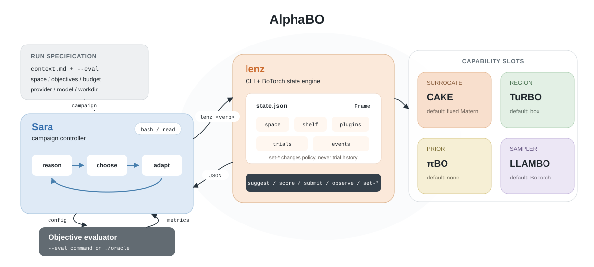

# AlphaBO

A modular framework for **agentic Bayesian optimization**.

Standard BO fixes a configuration $c = (M, \alpha, B, O, C)$ before the first
evaluation, then only updates the posterior as trials accumulate. Even methods
that adapt at runtime follow a schedule chosen in advance. Agentic BO keeps the
GP posterior and lets an LLM revise $c_{t}$ between evaluations [[1]](#ref-1).
The trial log $D_{t}$ is independent of the live configuration, so changing
$c_{t}$ does not discard data.

Meta's *Agentic Bayesian Optimization through Surrogate-Augmented Autoresearch*
instantiates that idea as Sara, a campaign LLM, calling lenz, a BoTorch CLI that
owns the trial log, posterior, and acquisition [[1]](#ref-1) [[6]](#ref-6). AlphaBO keeps that agent and CLI, then turns the backend into a
plug-in surface: surrogate, region, prior, and sampler are slots. Classical BO
methods wrap as `lenz` verbs the agent can enable, inspect, or override. The
control plane matches [MCP](https://modelcontextprotocol.io/). Sara's tools
remain `bash` and `read`, and plugins register extra verbs on that surface
instead of adding a second agent.



This is an independent re-implementation of Sara and lenz [[1]](#ref-1). It is
not an official Meta repository. The original paper has not released code.

The plugin protocol is new in this implementation. Methods wrap as backend
capabilities the agent invokes:

| Slot | Default | Plugin | Verbs |
|---|---|---|---|
| Surrogate | fixed Matérn | **CAKE** [[2]](#ref-2) | `set-surrogate`, `evolve-kernels`, `kernel-population` |
| Region | box | **TuRBO** [[3]](#ref-3) | `set-region`, `set-bounds`, `turbo status` |
| Prior | none | **πBO** [[4]](#ref-4) | `set-belief` |
| Sampler | BoTorch | **LLAMBO** [[5]](#ref-5) | `set-sampler`, `llambo sample` |

Sara still has only `bash` and `read`. Occupying a slot is a `set-*` verb.
Plugins may add more verbs. Method state lives in `state.json` under
`plugins`, not on the live shelf. Reconfiguring never discards trials.

`--no-lenz` drops the backend: Sara proposes configs and calls `./oracle`
herself (the test of whether the LLM can be the optimizer).

## Install

```bash
pip install -e .
```

Requires Python 3.10+. Dependencies include `torch`, `gpytorch`, `botorch`, and
LLM clients (`anthropic`, `openai`). Copy `.env.example` to `.env` for API
credentials.

## `lenz` (no LLM required)

```bash
lenz create --state ./state.json \
  --space '{"x1":{"kind":"range","lower":-5,"upper":10},"x2":{"kind":"range","lower":0,"upper":15}}' \
  --objectives '{"y":"minimize"}' \
  --acqf noisy_logei

lenz suggest --state ./state.json
lenz submit --state ./state.json --config '{"x1":1.0,"x2":2.0}' --metrics '{"y":12.3}'
lenz incumbent --state ./state.json
```

Command reference: `sara/prompts/LENZ_REF.md`.

## `sara` (the agent)

```bash
sara run \
  --provider anthropic --model claude-opus-5 \
  --context examples/branin/context.md \
  --eval "python3 examples/branin/eval.py" \
  --budget 30 \
  --workdir ./results/logs/branin-1
```

Required flags: `--context` (problem markdown), `--eval` (command that takes one
config JSON), `--budget`, `--workdir`.

| `--provider` | Notes |
|---|---|
| `anthropic` | `ANTHROPIC_API_KEY` |
| `openai` | `OPENAI_API_KEY` |
| `openai-compatible` | Requires `--base-url` |
| `ollama` | `http://localhost:11434/v1` by default |

CAKE and LLAMBO inherit Sara's provider and model. Pass `--kernel-llm-*` or
`--sampler-llm-*` only to use a different model. TuRBO and πBO do not call an
LLM.

## Plugins

```bash
lenz set-surrogate --state ./state.json --surrogate cake
lenz set-region --state ./state.json --policy turbo
lenz set-belief --state ./state.json --prior '{"x":{"dist":"normal","mu":0.3,"sigma":0.1}}'
lenz set-sampler --state ./state.json --sampler llambo
```

`lenz plugins` lists installed modules. Add a method by implementing
`LenzPlugin` in `lenz/plugins/` with a `PROMPT.md` beside it.

CAKE evolves a GP kernel population inside `lenz` during `observe`/`submit`
[[2]](#ref-2). It is not part of Sara's conversation.

```bash
lenz create --state ./state.json \
  --space '{"x1":{"kind":"range","lower":-5,"upper":10},"x2":{"kind":"range","lower":0,"upper":15}}' \
  --objectives '{"y":"minimize"}' \
  --surrogate cake --budget 30
```

## Experiments

Synthetic functions use an anti-memorization sandbox (renamed parameters, unit
cube, shifted optimum). Scoring uses a hidden answer key. List functions:

```bash
python3 -c "from benchmarks.functions import REGISTRY; print(sorted(REGISTRY))"
```

```bash
./scripts/run_synthetic.sh hartmann6
./scripts/run_synthetic.sh hartmann6 --disclosure revealed
./scripts/run_synthetic.sh hartmann6 --disclosure revealed-shift
./scripts/run_synthetic.sh hartmann6 --backend sara-lenz --disclosure all
./scripts/run_synthetic.sh hartmann6 --warmup 7
```

`--disclosure` is `blind` (default), `revealed`, `revealed-shift`, or `all`.
`--backend` is a comma list (`vanilla`, `cake`, `turbo`, `sara-lenz`,
`sara-lenz-cake`, `sara-only`), or `all` for vanilla + sara-lenz +
`sara-lenz-cake`. `--disclosure all` needs a single backend. Every backend
uses the same seeded Sobol warm-start, defaulting to `d+1` evaluations when a
seed is set. Pass `--warmup N` to override it for all selected backends.

To rerun only Sara-only in an existing synthetic comparison with the same
warm-start:

```bash
./scripts/rerun_sara_only.sh hartmann6
```

BoLT LoRA is mixed-type HPO [[7]](#ref-7) (always revealed, no textbook
optimum):

```bash
pip install -e '.[bolt]'
./scripts/run_bolt.sh
./scripts/run_bolt.sh --backend vanilla,cake
./scripts/run_bolt.sh --context generic
```

`--context` is `domain` (default), `generic`, or `misleading`.

Provider and model come from `.env` or `PROVIDER` / `MODEL`. Completed and
in-flight legs are skipped. Plots land in `compare.html` next to the run, or
open `sara-viz`.

## Run viewer (`sara-viz`)

```bash
sara-viz
sara-viz --root ./results/logs --port 9000
```

## Development

```bash
pip install -e ".[dev]"
pytest
./scripts/smoke_plugins.sh
./scripts/smoke_plugins.sh --live
```

`--live` issues one CAKE evolve and one LLAMBO sample. `--baseline` adds short
Hartmann6 vanilla and TuRBO loops.

## License

MIT. See [LICENSE](LICENSE).

## References

1. <span id="ref-1"></span> Brunzema, P., Tiao, L., Le, N., De Angeli, K., Xuan, Y.,
   Gligorijevic, D.
   *Agentic Bayesian Optimization through Surrogate-Augmented Autoresearch.*
   arXiv:2608.00316, 2026.
   [Paper](https://arxiv.org/abs/2608.00316)
   No official code (this repo is an independent re-implementation).

2. <span id="ref-2"></span> Suwandi, R. C., Yin, F., Wang, J., Li, R., Chang, T.-H.,
   Theodoridis, S.
   *Adaptive Kernel Design for Bayesian Optimization Is a Piece of CAKE with
   LLMs.* NeurIPS 2025.
   [Paper](https://proceedings.neurips.cc/paper_files/paper/2025/file/c03a2610bca2712b984b331fd4f7bb6f-Paper-Conference.pdf)
   [Code](https://github.com/richardcsuwandi/cake)

3. <span id="ref-3"></span> Eriksson, D., Pearce, M., Gardner, J., Turner, R. D.,
   Poloczek, M.
   *Scalable Global Optimization via Local Bayesian Optimization.* NeurIPS 2019.
   [Paper](https://arxiv.org/abs/1910.01739)
   [Code](https://github.com/uber-research/TuRBO)

4. <span id="ref-4"></span> Hvarfner, C., Stoll, D., Souza, A., Lindauer, M.,
   Hutter, F., Nardi, L.
   *πBO: Augmenting Acquisition Functions with User Beliefs for Bayesian
   Optimization.* ICLR 2022.
   [Paper](https://arxiv.org/abs/2204.11051)
   [Code](https://github.com/piboauthors/PiBO-Spearmint)

5. <span id="ref-5"></span> Liu, T., Astorga, N., Seedat, N., van der Schaar, M.
   *Large Language Models to Enhance Bayesian Optimization.* ICLR 2024.
   [Paper](https://arxiv.org/abs/2402.03921)
   [Code](https://github.com/tennisonliu/LLAMBO)

6. <span id="ref-6"></span> Balandat, M., Karrer, B., Jiang, D. R., Daulton, S.,
   Letham, B., Wilson, A. G., Bakshy, E.
   *BoTorch: A Framework for Efficient Monte-Carlo Bayesian Optimization.*
   NeurIPS 2020.
   [Paper](https://arxiv.org/abs/1910.06403)
   [Code](https://github.com/meta-pytorch/botorch)

7. <span id="ref-7"></span> Chew, R. W. T., Chen, Z., Hemachandra, A., Low, B. K. H.
   *BoLT: A Benchmark to Democratize Black-box Optimization Research for
   Expensive LLM Tasks.* arXiv:2605.17000, 2026.
   [Paper](https://arxiv.org/abs/2605.17000)
   [Code](https://github.com/chewwt/bolt)
